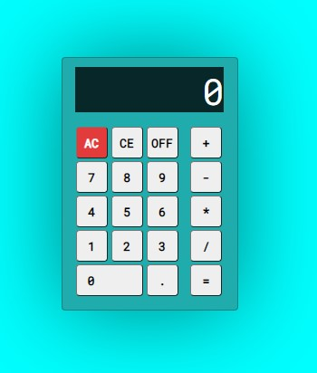

# calculadora-js

Tentando criar uma calculadora, com JS, HTML e CSS, fazendo do meu jeito mesmo, sem tutoriais nem nada assim.   Sei que o código vai ficar uma catástrofe, mas vou tentando aqui, no futuro vou refatorar, e aceito dicas, só fazer uma issue aí que eu agradeço de coração!

## Por enquanto o visual dela é esse
 \
[Clica aqui](https://artur906.github.io/calculadora-js/) pra interagir um pouco com ela, e ver como tá bugada kkkk

## Problemas que eu já encontrei 
* Dependendo do tamanho da conta o resultado estoura o display
* 7 digitos é pouco pra uma calculadora
* O botão OFF é meio inútil, mas achei legal implementar, só porque fiz com uma calculadora aqui do meu lado
* Preciso arrumar uma forma de respeitar a ordem das operações, por exemplo: 2 + 3 * 2 tem que dar 8
* Código sujo, cheio de gambiarra :) 
